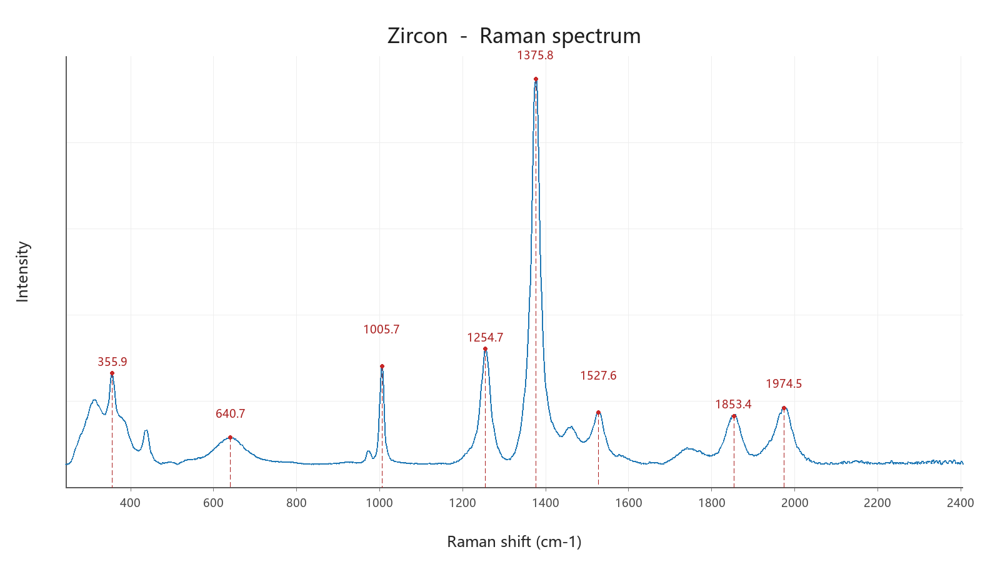
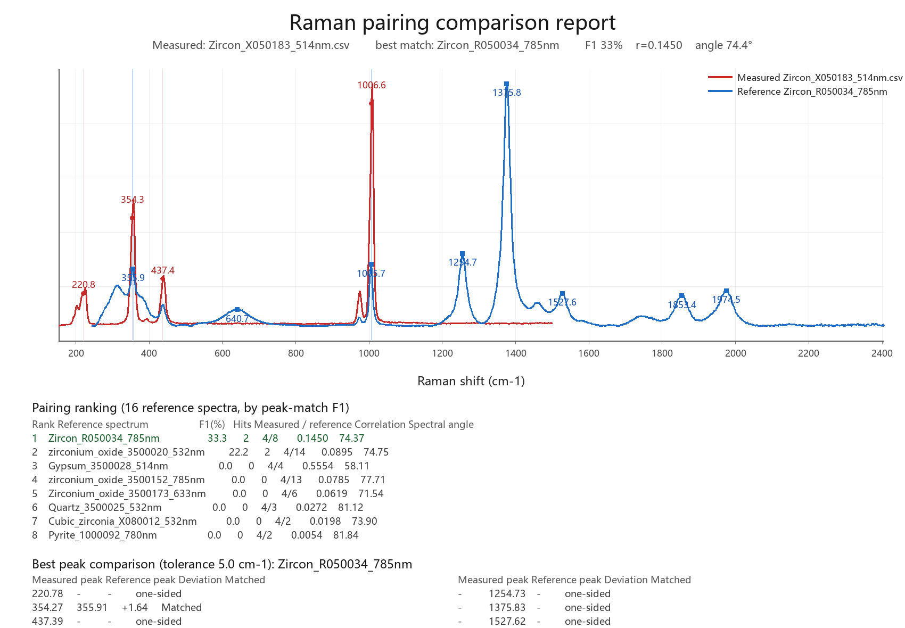
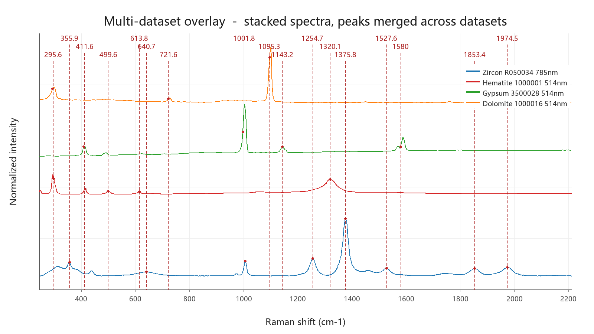

<div align="center">


# 拉曼光谱工具 · Raman Spectrum Toolkit

**JASCO `.jws` 光谱转换 · 拉曼峰分析 · 矿物鉴定**
**Convert · Analyze · Identify — JASCO `.jws` / CSV / SPC / JCAMP-DX spectra**

<b>中文</b> ｜ <a href="#english">English</a>

</div>

---

<a id="中文"></a>

## 这是什么

一个 Windows 桌面工具，把光谱仪导出的原始文件（JASCO `.jws`、`.csv`、`.spc`、`.jdx`、`.txt`、`.xlsx`）转成能直接看的图和能直接用的数据，
并内置拉曼光谱的常用处理、峰分析、**未知矿物鉴定**与 **RRUFF / ROD 参考谱库**对接。

界面、命令行、分析报告与说明书全部**中英双语**。

## 一眼看懂的功能

| 类别 | 能做什么 |
| --- | --- |
| **格式转换** | `.jws`/CSV/SPC/JCAMP-DX/TXT → CSV、**带图的 Excel**、PNG 曲线图、峰列表、JCAMP-DX |
| **峰分析** | 自动找峰并标注峰位（**峰位带波长虚线**）、**标错的峰连同自动峰一起右键删除、可一键恢复**、手动补标、高斯/洛伦兹/伪 Voigt 峰拟合、峰位检索；峰位数值可一键隐藏 |
| **未知谱鉴定** | 不知道样品是什么？拿它的峰去整个参考库比对，按可信度给出候选矿物 + 峰位对照 |
| **参考谱库** | 在线检索 ROD、按矿物批量抓取 RRUFF 数据包（拉曼 / 红外 / XRD / 化学成分），导出为本地库 |
| **配对比较** | 实测谱 ↔ 标准谱手动/自动配对，输出峰位匹配 F1、相关系数、谱角与对照报告图 |
| **预处理** | 尖峰（宇宙射线）去除、基线校正、平滑、导数、归一化、拉曼位移校准 |
| **统计分析** | 层次聚类 + PCA、二维成像热图、平均/相减、谱段替换、交互式 A−k·B 找平 |
| **多谱对照** | **瀑布图**（纵向错开，看有哪些峰）+ **多数据图叠加**（按 stacked spectra 排布：各条**上下错开、谱线分开**，每条一色带图例；**峰位跨谱合并，一个峰只画一条虚线、只标一个平均波数**；**先预览、左键加峰 / 右键删峰，确认后再导出**；横坐标取各条**交集**，可导出 PNG） |
| **批量与报告** | 整目录批处理 + 汇总表、自包含 HTML 分析报告（图片内嵌，可打印成 PDF） |

<table>
<tr>
<td width="50%"></td>
<td width="50%"></td>
</tr>
<tr>
<td align="center"><sub>自动识别并标注峰位，每个峰用虚线引到横坐标轴（锆石参考谱，785 nm）</sub></td>
<td align="center"><sub>未知谱 ↔ 库中标准谱配对报告（峰位匹配 F1 排序）</sub></td>
</tr>
</table>

<div align="center">



<sub><b>多数据图叠加</b> — 4 条光谱按 stacked spectra 上下错开、谱线分开，每条一色；峰位跨谱合并后<b>一个峰只画一条虚线、只标一个平均波数</b>。打开先出预览窗口，<b>左键加峰、右键删峰</b>，确认后再导出 PNG</sub>

</div>

## 快速开始

### 方式一：绿色版（推荐，免安装）

1. 到 **[Releases](../../releases)** 下载 `RamanSpectrumToolkit-v2.0.zip`
2. 解压到任意目录（含中文路径也可以）
3. 双击 `RamanSpectrumToolkit.exe`

不需要 Python，不写注册表，不联网也能用（联网只用于下载参考谱）。
所有工具自己下载/生成的数据都写在解压目录的 `工具数据/` 里，不会污染样品文件夹。

### 方式二：从源码运行

```bash
pip install pillow openpyxl        # PNG 出图与 Excel 导出需要；只用 CSV 可跳过
python jws2csv.py                  # 打开图形界面
```

也可以双击 `启动拉曼光谱工具.bat`（自动寻找本机 Python）。

## 命令行速查

```bash
python jws2csv.py a.jws 某文件夹              # 批量转换
python jws2csv.py --all a.jws                # CSV + Excel + PNG + 峰列表 + 峰拟合
python jws2csv.py --identify unknown.csv     # 未知光谱全库鉴定
python jws2csv.py --pair unknown.csv         # 与本地参考谱库配对
python jws2csv.py --rruff-fetch Zircon       # 一键下载 + 检索 + 导出锆石参考谱
python jws2csv.py --mineral-info Zircon      # 矿物信息卡（特征峰归属 + RRUFF 样品记录）
python jws2csv.py --cluster 文件夹           # 聚类分析 + 主成分
python jws2csv.py --map 5,5 --map-metric main_peak   # 二维成像热图
python jws2csv.py --waterfall 文件夹         # 瀑布图（纵向错开）
python jws2csv.py --overlay 文件夹           # 多数据图叠加（每条一色，批处理无预览）
python jws2csv.py --report 文件夹            # 自包含 HTML 分析报告
python jws2csv.py --lang en|zh               # 切换界面/输出语言
python jws2csv.py --manual                   # 打印完整说明书
```

完整参数见程序内【帮助 → 使用说明】或仓库里的 `使用说明.txt` / `User_Guide.txt`。

## 未知谱鉴定是怎么判的

先用参考库的**特征峰索引**做峰位粗筛（毫秒级），再对前列候选读原始谱精算：

* **综合分** = 0.5 × 峰位匹配 F1 + 0.5 × 强峰命中率
* **可信候选**要求三条同时成立：综合分 ≥ 60、未知谱最强 3 个峰至少命中 2 个、且领先第二名 ≥ 15 分
* 同时给出**偶然概率**（二项分布），分数接近时明确提醒“可能是库里没有对应矿物”
* 未命名样品单独提示，不会用没有矿物名的记录冒充结论

## 中文 / 英文

界面、日志、命令行输出、分析报告、图注与说明书都可切换：

* 菜单【设置 → 语言】
* 命令行 `--lang en|zh`
* 首次启动跟随 Windows 显示语言，之后记住你的选择

磁盘上的数据目录名（`工具数据 / 参考谱库 / RRUFF数据包 / 分析结果`）保持中文，保证两种语言下数据互通。

## 数据来源与致谢

* **RRUFF**（[rruff.info](https://rruff.info)）—— 参考谱与数据包来自 RRUFF 项目，请遵守其使用条款；
  本工具只是下载与检索客户端，**与 RRUFF 项目无隶属关系**。
* **ROD, Raman Open Database**（[rod.ens-lyon.fr](https://rod.ens-lyon.fr)）—— 在线拉曼参考谱检索。
* `.jws` 二进制结构参考开源项目 `jasco_jws_reader` / `jasco-jws-converter` 的 DataInfo 说明；
  本工具的数值解析已与参考实现逐点比对一致。

## 许可

[MIT](LICENSE)

---

<a id="english"></a>

## English

**Raman Spectrum Toolkit** is a Windows desktop tool that turns raw spectrometer exports
(JASCO `.jws`, `.csv`, `.spc`, JCAMP-DX `.jdx`, `.txt`, `.xlsx`) into charts and usable data,
and bundles the everyday Raman workflow: peak detection and fitting, mineral peak assignment,
**unknown-spectrum identification** against RRUFF / ROD reference libraries, pairing,
clustering, 2D imaging, batch conversion and HTML reports.

The GUI, CLI, reports and manuals are **fully bilingual (Chinese / English)**.

### What it does

| Area | Capability |
| --- | --- |
| **Conversion** | `.jws` / CSV / SPC / JCAMP-DX / TXT → CSV, **Excel with embedded chart**, PNG plot, peak table, JCAMP-DX |
| **Peak analysis** | automatic peak detection with position labels (**each peak gets a dashed line down to the x axis**), **right-click to delete a wrong peak — automatic ones included — and restore them all with one click**, manual annotation, Gaussian / Lorentzian / pseudo-Voigt fitting, peak-position search; peak values can be hidden |
| **Unknown spectra** | identify a spectrum whose mineral you do not know by matching its peaks against a whole reference library, with confidence ranking and a peak-by-peak comparison |
| **Reference libraries** | search ROD online, bulk-fetch RRUFF packages (Raman / IR / XRD / chemistry), export them into a local library |
| **Pairing** | measured ↔ reference pairing (manual or automatic) with peak-match F1, correlation, spectral angle, and a comparison report figure |
| **Preprocessing** | spike (cosmic ray) removal, baseline correction, smoothing, derivative, normalization, Raman shift calibration |
| **Statistics** | hierarchical clustering + PCA, 2D imaging heat map, average / subtract, range replacement, interactive A−k·B flattening |
| **Multi-spectrum comparison** | **waterfall** (offset stacks, to see *which* peaks are there) + **multi-dataset overlay** (stacked-spectra layout: curves **offset and separated**, one colour each with a legend; **peaks merged across datasets — one dashed line and one averaged value per peak**; **preview first, left-click to add / right-click to remove peaks, export only after you confirm**; x axis is the **intersection** of all ranges) |
| **Batch & reports** | whole-folder batch conversion with a summary table, self-contained HTML report (images embedded, printable to PDF) |

### Quick start

**Portable build (no Python needed)**

1. Download `RamanSpectrumToolkit-v2.0.zip` from **[Releases](../../releases)**
2. Unpack anywhere and run `RamanSpectrumToolkit.exe`

Everything the tool downloads or produces stays inside `工具数据/` next to the executable,
so your sample folders are never touched.

**From source**

```bash
pip install pillow openpyxl
python jws2csv.py
```

### Command line

```bash
python jws2csv.py --identify unknown.csv    # identify an unknown spectrum
python jws2csv.py --pair unknown.csv        # pair against your local library
python jws2csv.py --rruff-fetch Zircon      # download + index + export Zircon references
python jws2csv.py --waterfall folder        # waterfall chart (offset stacks)
python jws2csv.py --overlay folder          # multi-dataset overlay, one colour each (batch, no preview)
python jws2csv.py --report folder           # self-contained HTML analysis report
python jws2csv.py --lang en|zh              # switch UI / output language
python jws2csv.py --manual                  # print the full user guide
```

### How identification works

Reference peaks are pre-indexed for a millisecond-level pre-filter; the top candidates are then
re-scored against their original spectra. The **combined score** is
`0.5 × peak-match F1 + 0.5 × strong-peak hit rate`. A result is marked **reliable** only when
the score ≥ 60, at least 2 of the 3 strongest peaks are matched, and it leads the runner-up by ≥ 15
points; a binomial **chance probability** is reported and close scores trigger an explicit warning
that the mineral may simply not be in the library. Unnamed RRUFF records are never presented as an
identification.

### Credits

Reference spectra and data packages come from the **RRUFF** project ([rruff.info](https://rruff.info))
and the **Raman Open Database** ([rod.ens-lyon.fr](https://rod.ens-lyon.fr)).
This tool is an independent client and is **not affiliated with those projects**.

### License

[MIT](LICENSE)
